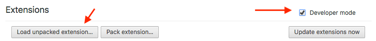

# Klasse Chrome Extension
De bedoeling van deze repository is research te doen naar de ontwikkeling van een Chrome extension en de mogelijkheden hiervan.

# Functionaliteit
De extensie neemt de content van een nieuwe Chrome tab over, en toont daar een onderwijsgerelateerde Loesje-poster en rechts onderaan een Lerarenkaart-voordeel dat geografisch in de buurt van de gebruiker is (10km vogelvlucht).

Links onderaan is een refresh button waarmee zowel poster als voordeel hernieuwd worden.

# Development
Alle bronbestanden staan in `klasse_extension_src`. Hierin staat een package.json file met dependencies. Te installeren door `npm install` te doen in de `klasse_extensions_src` directory.

Door `gulp` te doen in de `klasse_extension_src` directory wordt LESS gecompileerd en worden verder alle nodige files gekopieerd vanuit de `klasse_extension_src` directory naar de `klasse_extension` directory.

# Installatie
* Download de bestanden en zorg dat je de directory `klasse_extension` weet staan (zet 'm op je desktop of zo).
* Je gaat in Chrome naar `chrome://extensions/`
* Je vinkt rechtsboven `Developer Mode` aan
* Je klikt links bovenaan op de knop `Load unpacked extension...`
* Kies de directory `klasse_extension`
* De extension zal nu in de lijst van geïnstalleerde extensions verschijnen.

